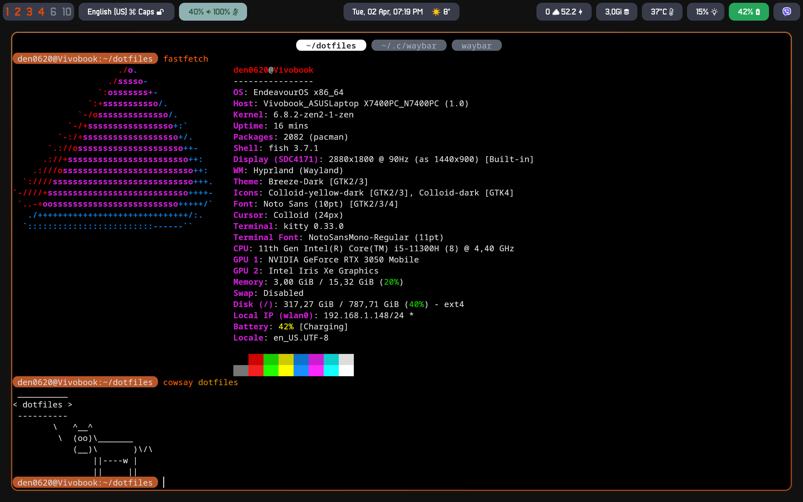

# dotfiles
eeeh dotfiles?
- fish shell (prompt)
- hyprland (something here, something there)
- kitty (pretty in-config tabs)
- waybar (status bar)

## note
Thanks to the *lgaboury* for the good [waybar example](https://github.com/lgaboury/Sway-Waybar-Install-Script)

