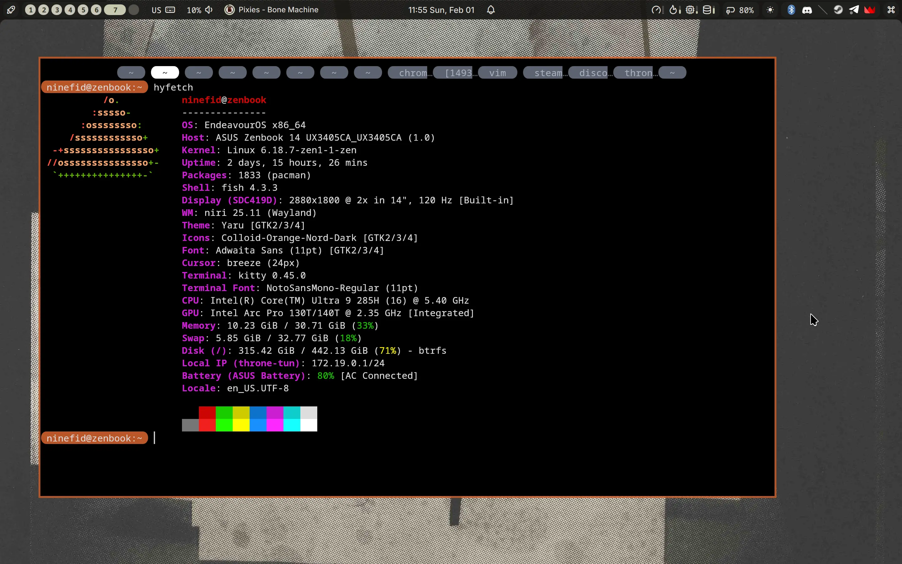

# dotfiles

- [x] [fish](https://fishshell.com/) (shell/prompt)

- [x] [niri](https://github.com/YaLTeR/niri) (compositor)

- [x] [noctalia-shell](https://github.com/noctalia-dev/noctalia-shell) (shell)

- [x] [kitty](https://sw.kovidgoyal.net/kitty/) (pretty in-config tabs)

- [ ] [nemo](https://wiki.archlinux.org/title/Nemo) (file manager)

- [ ] [polkit-gnome](https://wiki.archlinux.org/title/Polkit) (gtk polkit)

- [ ] [gnome-keyring](https://wiki.archlinux.org/title/GNOME/Keyring) (widely supported keyring)

- [ ] [pavucontrol](https://freedesktop.org/software/pulseaudio/pavucontrol/) (sound control)

- [ ] [gpu-screen-recorder](https://git.dec05eba.com/gpu-screen-recorder/about/) (screen recorder)

- [x] [wtype](https://github.com/atx/wtype) (keybinds)

- [x] charge limiter (80)

- [x] start qemu network

Checkmarks meaning presence of config



## installation
no autoinstall script

(but there arent many)

```
pacman -S fish niri noctalia-shell gpu-screen-recorder cliphist kitty nemo nemo-fileroller fuzzel polkit-gnome pavucontrol wtype xwayland-satellite xdg-desktop-portal-wlr
```

config/ contents go in .config/

utils/ contents may go in /sbin/ or where you like it more

I may forget something

## niri

`Super + Q` spawns `kitty`

`Super + D` spawns `nemo`

`Super + F` spawns `firefox`

`Super + T` spawns `Telegram`

`Super + R` spawns launcher (noctalia)

`Super + Alt + L` locks session (noctalia)

`Super + Alt + P` powers off monitors (niri)

## note

